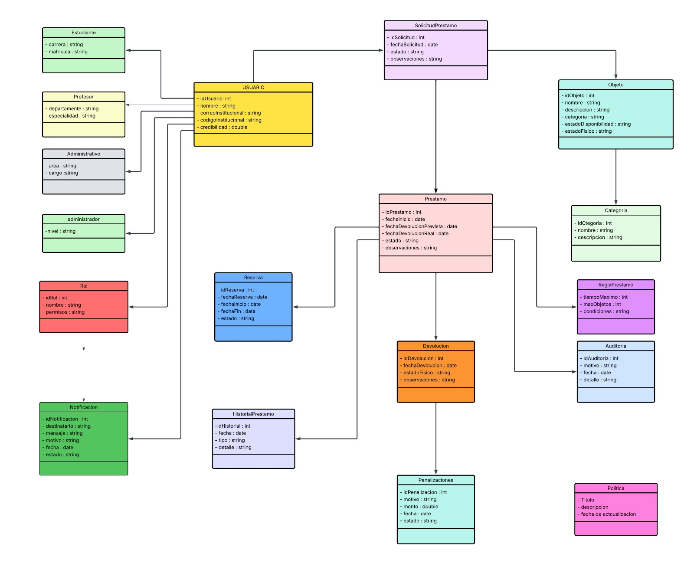
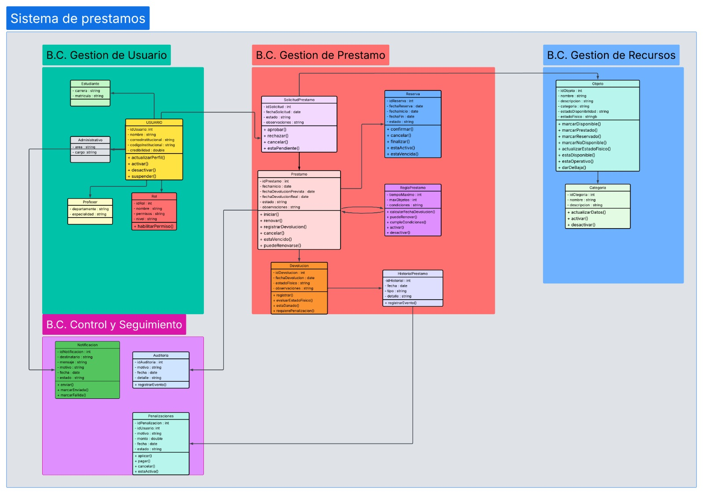

# Sistema de Préstamos Universitarios

## Grupo 1

Sistema en construcción para gestionar el préstamo de recursos de una
universidad.

### Integrantes

- Elyud
- Roid
- David
- Eduardo

## Análisis de requisitos

## Requisitos funcionales

### Gestión de usuarios

- RF01 Registro de usuarios
- RF03 Gestión de perfiles
- RF04 Gestión de roles

### Gestión del inventario

- RF05 Visualización del inventario
- RF06 Registro de objetos
- RF07 Modificación de objetos
- RF08 Baja o eliminación de objetos
- RF09 Consulta de disponibilidad
- RF10 Registro del estado físico

### Gestión de préstamos

- RF11 Solicitud de préstamo
- RF12 Registro de préstamo
- RF13 Registro de devolución
- RF14 Control de préstamos vencidos
- RF15 Historial por objeto
- RF16 Historial por usuario

### Reservas

- RF17 Reserva de objetos
- RF18 Consulta/cancelación de reservas

### Usuarios y confiabilidad

- RF19 Indicador de confiabilidad

### Administración

- RF20 Gestión de usuarios
- RF21 Gestión de inventario
- RF22 Gestión de solicitudes

### Notificaciones

- RF23 Notificaciones por correo institucional

### Información

- RF24 Consulta de políticas de préstamo

## Requisitos no funcionales

- RNF01 Seguridad
- RNF02 Control de acceso
- RNF03 Usabilidad
- RNF04 Integridad de datos
- RNF05 Disponibilidad
- RNF06 Rendimiento
- RNF07 Mantenibilidad

## Diagrama de clases

<!-- Agregar aquí la imagen del diagrama de clases. -->



_Reemplazar la ruta anterior por la ubicación real de la imagen._

## Bounded Contexts

El sistema se divide provisionalmente en cuatro Bounded Contexts:

1. **Gestión de Usuario:** usuarios, perfiles y roles.
2. **Gestión de Préstamo:** solicitudes, préstamos, reservas y devoluciones.
3. **Gestión de Recursos:** objetos, categorías y disponibilidad.
4. **Control y Seguimiento:** historial, notificaciones, auditoría y
   penalizaciones.

<!-- Agregar aquí la imagen del diagrama de Bounded Contexts. -->



_Reemplazar la ruta anterior por la ubicación real de la imagen._

## Estructura actual de carpetas

```text
Sistema_prestamo/
├── backend/
│   └── usuarios/
│       └── presentation/
│           └── usuario_routes.py
├── frontend/
│   ├── public/
│   ├── src/
│   ├── package.json
│   └── vite.config.ts
├── main.py
└── README.md
```

## Tecnologías

- **Backend:** Python y FastAPI
- **Frontend:** React, TypeScript y Vite

## Plan de trabajo por sprints

Los sprints son provisionales y todos los integrantes participan en tareas de
análisis, desarrollo, pruebas e integración.

### Sprint 0 - Análisis y diseño

- Validar requisitos funcionales y no funcionales.
- Revisar el diagrama de clases.
- Revisar los Bounded Contexts.
- Definir tareas técnicas y criterios de aceptación.

### Sprint 1 - Base del proyecto y usuarios

- Organizar la arquitectura del backend y frontend.
- Implementar el registro y gestión inicial de usuarios.
- Definir perfiles, roles y control de acceso.
- Crear pruebas iniciales.

### Sprint 2 - Inventario y recursos

- Implementar el registro y consulta de objetos.
- Implementar categorías y estados físicos.
- Implementar disponibilidad, modificación y baja de objetos.
- Integrar frontend, backend y pruebas.

### Sprint 3 - Solicitudes y préstamos

- Implementar solicitudes de préstamo.
- Implementar aprobación, rechazo y registro del préstamo.
- Aplicar las reglas de préstamo.
- Validar el flujo completo con pruebas.

### Sprint 4 - Reservas y devoluciones

- Implementar reservas y cancelaciones.
- Implementar el registro de devoluciones.
- Controlar préstamos vencidos.
- Actualizar la disponibilidad de los objetos.

### Sprint 5 - Historial, notificaciones y confiabilidad

- Implementar historial por usuario y por objeto.
- Implementar notificaciones institucionales.
- Implementar el indicador de confiabilidad.
- Integrar auditoría y penalizaciones.

### Sprint 6 - Integración y presentación

- Ejecutar pruebas integrales.
- Corregir errores y mejorar la interfaz.
- Completar la documentación.
- Preparar la demostración y presentación final.

## Estado del proyecto

El proyecto se encuentra en fase de construcción. Las funcionalidades,
diagramas y sprints se actualizarán conforme avance el desarrollo.
